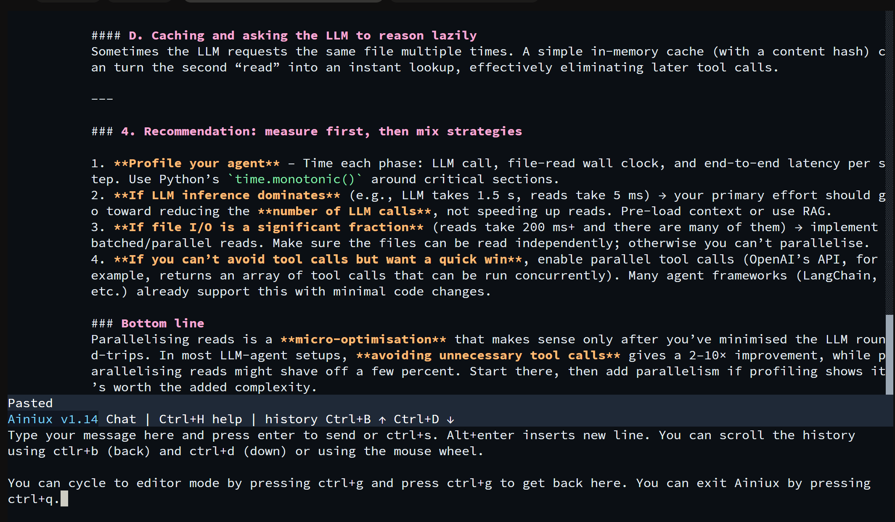
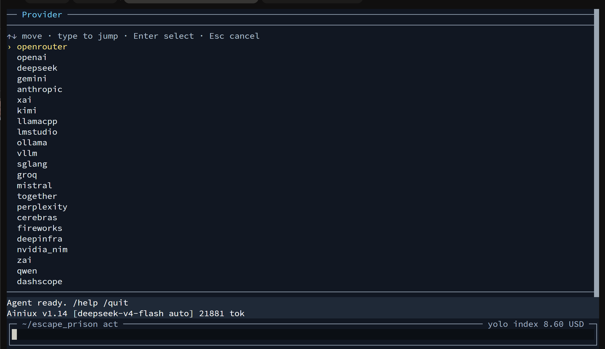
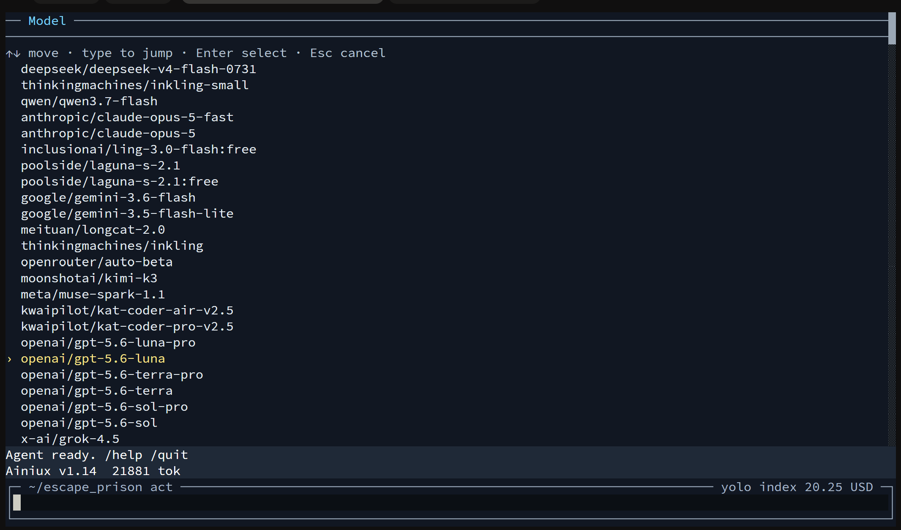
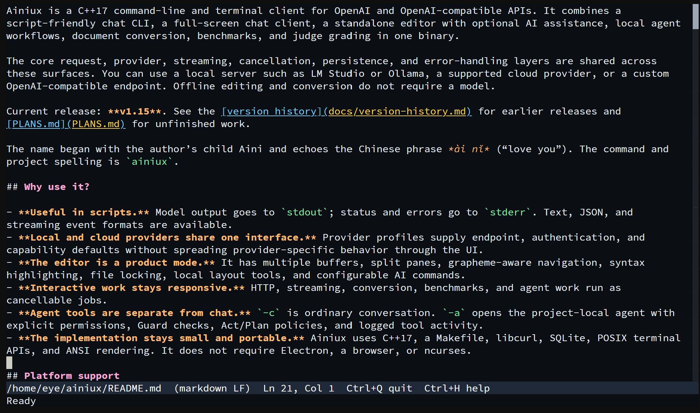
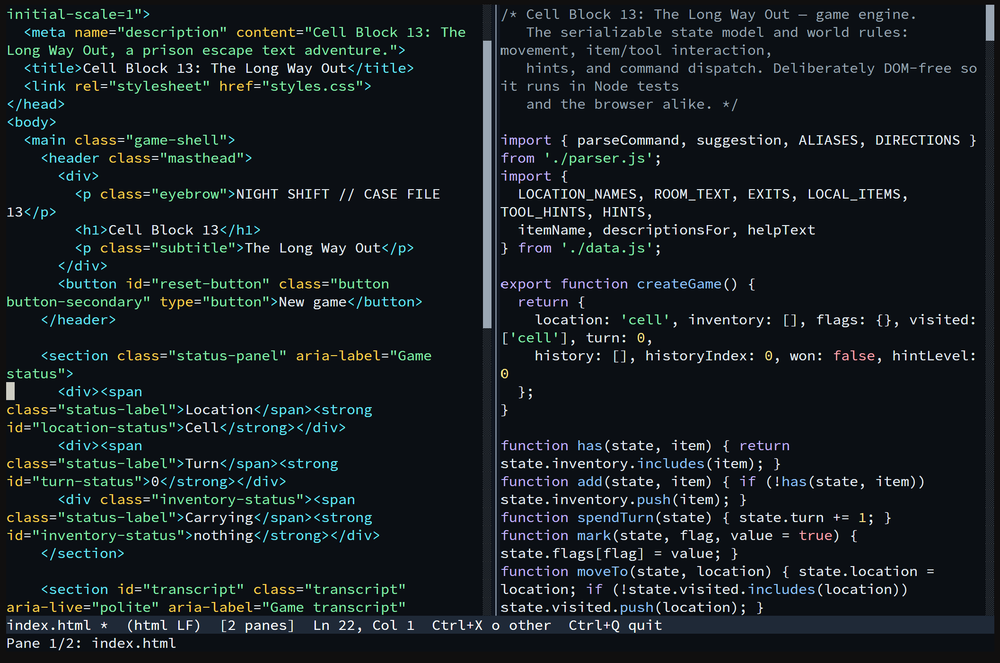
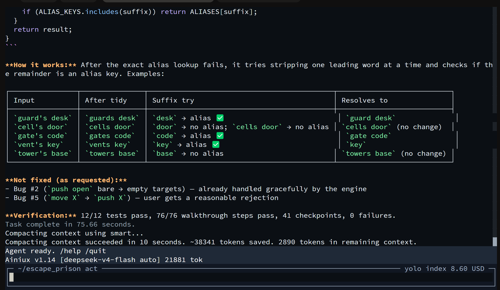
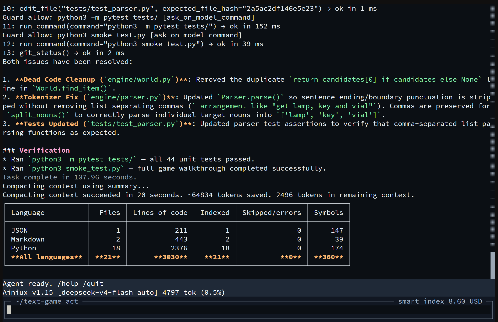
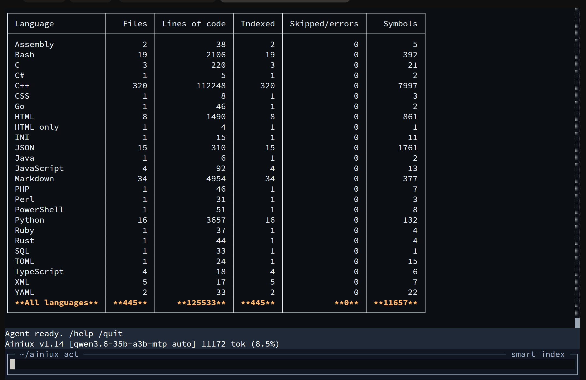

# Ainiux


Ainiux is a C++17 command-line and terminal client for OpenAI and OpenAI-compatible APIs. It combines a script-friendly chat CLI, a full-screen chat client, a standalone editor with optional AI assistance, local agent workflows, document conversion, benchmarks, and judge grading in one binary. You can freely cycle between the modes from chat/agent to editor by pressing ctrl+g. One binary to rule them all.

You can use a local server such as LM Studio, llama-server, vllm or Ollama, a supported cloud provider such as OpenRouter, Google, Anthropic or Deepseek, or a custom OpenAI-compatible endpoint. Offline editing and conversion do not require a model.

Current release: **v1.18**. See the [version history](docs/version-history.md) for earlier releases and [PLANS.md](PLANS.md) for unfinished work.

The name began with the author’s child Aini and echoes the Chinese phrase 爱你 *ài nǐ* (“love you”). The command and project spelling is `ainiux`. It also signifies the future aims of this ambitious project: versatile AI tool (current state) → Ainiux programming language (new programming language for AI era) → Ainiux operating system.

## Why use it?

- **Useful in scripts.** Model output goes to `stdout`; status and errors go to `stderr`. Text, JSON, and streaming event formats are available.
- **Local and cloud providers share one interface.** Provider profiles supply endpoint, authentication, and capability defaults without spreading provider-specific behavior through the UI.
- **Fully Featured Text and Code Editor.** It has multiple buffers, split panes, grapheme-aware navigation, syntax highlighting, file locking, local layout tools, configurable AI commands, and a full-screen **dired** directory browser (`ainiux -d`, `F4`, or `Ctrl+X d`).
- **Interactive work stays responsive.** HTTP, streaming, conversion, benchmarks, and agent work run as cancellable jobs.
- **Agent tools are separate from chat.** `-c` is ordinary conversation. `-a` opens the project-local agent with explicit permissions, built-in guard against destructive commands, Act/Plan policies, and logged tool activity.
- **The implementation stays small and portable.** Ainiux uses C++17, a Makefile, libcurl, SQLite, native POSIX/Win32 platform backends, and ANSI/VT rendering. It does not require Electron, a browser, or ncurses. And it won't eat all of your RAM.

## Platform support

Ubuntu on x86-64 and ARM64 remains the primary tested baseline. Apple Silicon macOS 15+ supports source builds with Apple Clang, GNU Make, and Homebrew dependency metadata. A native Windows 10 1903+/Windows 11 x64 target builds in MSYS2 UCRT64; Windows Terminal and modern conhost are supported for full-screen modes, while mintty is rejected with a clear diagnostic. Portable Windows release artifacts remain gated on the native parity workflow. BSD and other POSIX-like systems are targeted where practical but are not all continuously tested. See [Getting started](docs/getting-started.md#build-on-apple-silicon-macos-15) and [Native Windows](docs/windows.md).

Ainiux is provided under the [Modified MIT License](LICENSE). It is provided **“as is,” without warranty**; review the license before relying on it for important work.

## Install

On Ubuntu or Debian, clone the repository and let the installer add dependencies, build, and install into `/usr/local`:

```sh
git clone https://github.com/petrikuittinen/ainiux.git
cd ainiux
./scripts/install.sh --with-deps -y
ainiux --version
```

To build without installing:

```sh
sudo apt update
sudo apt install -y build-essential pkg-config git libsqlite3-dev libcurl4-openssl-dev
make
./ainiux --version
```

Some Ubuntu releases name the curl runtime package `libcurl4t64`; the dependency script selects the available package. `./scripts/install.sh --user` installs below `~/.local`, and `make optimized` creates a stripped release-style build. Detailed package, installation, upgrade, and platform notes are in [Getting started](docs/getting-started.md).

## Four ways to start

One-shot chat is the simplest scripted path:

```sh
ainiux lmstudio -p "Explain RAII in three sentences."
```

Start the saved-thread chat interface with `-c`:

```sh
ainiux lmstudio -c
```







Open the standalone editor with `-e`. Provider `none` keeps it completely offline. Open the directory browser with `-d` / `--dired` (optional path; default is `.`):

```sh
ainiux none -e notes.md
ainiux -d
ainiux -d src/
```





Start an interactive project agent with `-a`:

```sh
ainiux deepseek -m "deepseek-v4-flash" -a
```







Chat, editor, and agent share terminal presentation and selectors, but not semantics. Switch explicitly with `/chat`, `/editor`, `/agent`, `/mode`, `/cycle`, or `Ctrl+G`. From an interactive agent turn you can hop to the editor or dired with `Ctrl+G` / `F4` without cancelling the turn; temporary editor hops keep the project session open. Leaving for chat or quitting finishes the agent session and disarms tools.

Ainiux works especially well with **DeepSeek-V4-Flash**, **DeepSeek-V4-Pro**,
**GPT-5.6**, and local **Qwen3.6** and **Gemma-4** model series. These are the
families used most heavily while developing and testing the current agent,
reasoning, tool-calling, and local OpenAI-compatible server paths. Exact model
availability and identifiers still depend on the selected provider or local server.

## Current v1.18 capabilities

The product is actively developed, but its primary surfaces are implemented and share production-oriented foundations: incremental SSE parsing, explicit connect and request timeouts, cancellation during active streams, credential redaction, structured errors, bounded inputs, and RAII ownership of network, database, terminal, and file resources. A network chunk is never assumed to be one complete SSE event, and partial UTF-8 is kept out of terminal rendering.

Long-running work is owned by a runtime job rather than the terminal loop. This lets the chat and editor continue handling input, scrolling, resizing, pickers, and cancellation during requests or file work. Provider adapters own request and response differences; the CLI, editor, and TUI do not construct provider-specific JSON independently.

### CLI and conversion

Use `-p` for a prompt, `-i` for the line-oriented REPL, and `--no-stream` when a complete response is preferable. `--format json` returns one object; `--format ndjson` or `jsonl` returns events. `--output-format` renders response or conversion output.

```sh
ainiux openai -m MODEL -p "Summarize the tradeoffs" --no-stream
ainiux openrouter -m MODEL -i
ainiux --input page.html --output-format md
ainiux --fetch-url https://example.com --output-format plaintext
printf 'piped text' | ainiux --input stdin --output stdout
```

Text, Markdown, and HTML can be attached with `--attach`. PNG, JPEG, and GIF input is available through compatible Chat Completions models. PDF and DOCX conversion are not yet implemented. URL fetching happens only when explicitly requested with `--fetch-url` or `/fetch`; a URL inside a prompt never triggers a fetch. Private, loopback, link-local, multicast, and metadata addresses are blocked unless explicitly allowed.

Web search supports API providers and keyless fallbacks:

```sh
ainiux lmstudio -p "Summarize these results" --search "C++17 terminal UI"
```

See [CLI and scripting](docs/cli.md) for context policies, output contracts, attachments, fetch/search safety, and exit behavior.

The `-i` REPL is intentionally simpler than the full-screen client and works well over basic terminals. Use `-c` when thread selection, multiline drafts, attachments, themes, and background UI activity matter. Use the default one-shot path when another program should own the conversation flow.

### Full-screen chat

The `-c` interface has a SQLite-backed thread library, multiline grapheme-aware input, attachments, themes, syntax-highlighted Markdown, cancellable streaming, model and reasoning selectors, and JSON import/export. Threads are stored in `~/.ainiux/ainiux.db`; managed media lives under `~/.ainiux/media/`.

On startup, choose a thread or press `Tab`/`Insert` for a new one. `Ctrl+L` reopens the library, `Ctrl+P` selects a provider, `Ctrl+E` edits the last user or assistant message, `Ctrl+R` regenerates the previous answer, and `Ctrl+G` opens the editor. Editor-only `/width` and alignment commands are rejected in chat and agent history.

See [Chat TUI](docs/chat.md) and the [keyboard reference](docs/keyboard-shortcuts.md).

Saved chat data and project agent data are deliberately separated. Removing or moving a project’s `.ainiux-pr/` does not remove the personal chat library, and ordinary chat threads do not become agent transcripts when modes are switched. Explicit JSON chat import/export remains available when a portable file is preferable to the local SQLite library.

### Standalone editor

The editor is usable with or without AI. It supports multiple buffers, horizontal and vertical splits, advisory file locks, external-change checks, auto-save backups, undo/redo, search/replace, word and path completion, syntax highlighting, reformatting, Unicode grapheme navigation, terminal cell-width rendering, preserved line endings, and full-screen **dired** (`-d` / `--dired`, `F4`, `Ctrl+X d`) with content-hash dirty markers, optional `.ainiux-pr/history` line-diff tints in the read-only preview, and `n`/`p` jumps between changed blocks.

When idle, `Ctrl+E`, `Esc`, or `Alt+X` opens the command minibuffer. `Ctrl+Space` runs mode-aware continuation, and `Ctrl+R` regenerates the previous AI assist. `/spell`, `/grammar`, `/rewrite`, translations, and other commands come from layered `editor-commands.conf` files. Local `/left-align`, `/right-align`, `/center-align`, `/justify`, and line-cleanup commands work offline. You can TAB complete any command.

See the detailed [editor help](docs/editor_help.md) and [keyboard reference](docs/keyboard-shortcuts.md).

Writable file buffers hold an advisory `FILE.LOCK` session and check for external changes before overwrite. Lock contention opens the existing file read-only; Save As can move work to a writable path. File endings and detected indentation are buffer properties, and large background reformat operations are discarded if their source changes before completion.

### Local agent

Interactive `-a` and one-shot `run` use project-local `.ainiux-pr/` state and native workspace tools. Act mode can read and modify the contained workspace subject to Confirm, Smart, or Yolo permissions and Guard classification. Interactive Guard “Ask” actions require `y`/`n` approval (including while you are reviewing in the editor after a mid-turn hop). Script Asks also offer **Review**, which opens that file in dired; `q` returns to the dialog. Plan mode retains research tools but code-enforces writes to planning documents only. During a long interactive turn, `Ctrl+G` or `F4` opens the editor/dired so you can review dirty files and history-tinted change lines without cancelling tools or finishing the project session.

```sh
ainiux lmstudio -m MODEL -r "add focused tests for the parser"
ainiux plan "design local server mode" --provider openai -m MODEL
ainiux lmstudio -m MODEL --security-review
```

Interactive `/plan` and `/act` switch the task policy for the current session. `/goal CONDITION` sets a persistent completion condition and auto-continues until the model calls `goal_met` with evidence, stalls, reaches the turn cap, or is interrupted. `/compact fast|smart|summary` reduces model-visible context while preserving the full transcript on disk. `/compact all` resets model context to the system prompt, `AGENTS.md`, and tool definitions (logs stay in `.ainiux-pr`). Automatic compaction uses **75% of every known context window** unless explicitly configured otherwise.

The optional code index is an optimized in-house C++ definitions index, not a compiler-grade parser or ground truth. It stores files, definitions, and static declaration importance, while lexical relevance stays primary. Agents must verify indexed locations against current source before editing.

```sh
ainiux --index-code
ainiux --print-index
ainiux --clear-index
```

In a measured audit on the current 20-core ARM64 system, 437 files and 11,631 definitions were indexed in 110–149 ms across three cold runs. Repository contents, storage, builds, and hardware vary, so this is a point-in-time measurement rather than a universal performance guarantee.

See [Agent workflows](docs/agent.md), [MCP servers](docs/mcp.md), [code-index internals](docs/code_index_and_tool_calls_explained.md), and [Security](docs/security.md).

The native tool API is deliberately compact: `index`, `ls`, `glob`, `grep`,
`symbol`, `outline`, `read`, `run`, `fetch`, `web_search`, `goal_met`, `attach`,
`edit`, `write`, `mkdir`, `mv`, `rm`, and `apply_patch` as applicable to the
session. Removed long names and aliases are not silently accepted. See the
[native tool inventory](docs/tool_calls.md) for availability and policy details.

### MCP tools (agent only)

Install servers into `~/.ainiux/mcp/registry.json` (CLI; no model key required), then use them from `-a` / `--run` / `--plan`:

```sh
ainiux --add-mcp catalog --mcp-url https://awesome-mcp.tools/mcp
ainiux --list-mcp
ainiux --add-mcp time --mcp-transport stdio -- npx -y @modelcontextprotocol/server-time
```

Tools appear as `mcp__<server>__<tool>`. In agent: `/list-mcp`, `/enable-mcp`, `/disable-mcp`, `/remove-mcp`; `/add-mcp` shows CLI install examples (install stays CLI-only). Full guide: [docs/mcp.md](docs/mcp.md).

For a **text-only agent model + local vision LLM**, use the bundled bridge
(optional Pillow/`ffmpeg` downscale to ~1024px long edge for large PNG/JPEG/GIF/WebP):

```sh
python3 scripts/image_mcp_server.py http://localhost:30000 --port 8765
ainiux --add-mcp local-image --mcp-url http://127.0.0.1:8765/mcp --mcp-allow-private
ainiux deepseek -m deepseek-v4-flash -r "Describe the attached image." \
  --attach tests/image_files/sea_view.jpg
```


One-shot modes print compact tool activity to `stderr` and reserve `stdout` for the final answer. Plan and Act are enforcement policies, not merely prompt labels: Plan mutations are restricted to recognized planning Markdown paths. The security-review path remains read-only even though the broader agent engine supports mutations.

### Benchmarks and grading

The built-in UTF-8 JSONL corpus currently has 133 cases. Benchmark mode supports category, case, mode, duration, run, warmup, limit, and concurrency selection; it records machine-readable results and continues through individual failures where possible. Grade mode is a separate second pass using a judge model and runtime prompts from `benchmarks.conf`.

```sh
ainiux benchmark --category reasoning --limit 2 --provider lmstudio -m MODEL
ainiux --grade --grade-input results/benchmark-TIMESTAMP.jsonl --provider openai -m JUDGE_MODEL
```

Judge scores are model outputs, not objective proof. Cutoff cases especially need periodic calibration because their facts and wording age. See [Benchmarks and grading](docs/benchmarks.md).

Datasets and results are line-oriented so failed cases do not make all preceding work unreadable. `--validate-dataset` and `--list-cases` inspect selection without making model calls. Concurrency can improve throughput but can also change provider throttling, latency, and score comparability.

## Provider profiles and credentials

Use a profile positionally (`ainiux lmstudio -c`) or with `--provider`. A raw base URL is also accepted. Local profiles normally require no key, although LM Studio and custom servers can be configured to require one. Cloud profiles use the first available variable shown below. `AINIUX_API_KEY` is the shared fallback for every keyed built-in profile.

| Profile | Aliases | Provider-specific key variables |
| --- | --- | --- |
| `none` | `offline` | None |
| `openrouter` | — | `OPENROUTER_API_KEY` |
| `openai` | `openai_chat`, `openai_responses` | `OPENAI_API_KEY` |
| `deepseek` | — | `DEEPSEEK_API_KEY` |
| `gemini` | — | `GEMINI_API_KEY` |
| `anthropic` | — | `ANTHROPIC_API_KEY` |
| `xai` | `grok` | `XAI_API_KEY` |
| `moonshot` | `kimi` | `MOONSHOT_API_KEY` |
| `llamacpp` | `llama_cpp`, `llama.cpp` | None |
| `lm_studio` | `lmstudio` | `LMSTUDIO_API_KEY`, `LM_STUDIO_API_KEY` |
| `ollama` | — | None |
| `vllm` | — | None; built-in dummy key for compatible servers |
| `sglang` | `sg_lang`, `sg-lang` | None |
| `groq` | — | `GROQ_API_KEY` |
| `mistral` | — | `MISTRAL_API_KEY` |
| `together` | — | `TOGETHER_API_KEY` |
| `perplexity` | — | `PERPLEXITY_API_KEY` |
| `cerebras` | — | `CEREBRAS_API_KEY` |
| `fireworks` | — | `FIREWORKS_API_KEY` |
| `deepinfra` | — | `DEEPINFRA_API_KEY`, `DEEPINFRA_TOKEN` |
| `nvidia_nim` | — | `NVIDIA_NIM_API_KEY` |
| `zai` | `z.ai`, `z_ai` | `ZAI_API_KEY` |
| `qwen` | `dashscope_intl` | `DASHSCOPE_API_KEY`, `QWEN_API_KEY` |
| `dashscope` | — | `DASHSCOPE_API_KEY` |
| `custom_openai_chat` | `custom` | `AINIUX_API_KEY` |

The Anthropic profile uses its OpenAI compatibility layer; a native Anthropic Messages adapter is not implemented. OpenAI Responses support is text-only for ordinary chat. Capability metadata is a starting point, not live proof that a particular model supports every feature.

For any provider, `--key-env NAME`, `--key-file PATH`, or `--key-stdin` selects another source. Avoid `-k`/`--key` because command-line arguments may be visible to other local users. Sensitive headers and configured keys are redacted from diagnostics and saved artifacts.

Search has separate credentials and endpoints:

| Search provider | Key variables | Base URL variable | Notes |
| --- | --- | --- | --- |
| Tavily | `TAVILY_API_KEY` | — | API search |
| Firecrawl | `FIRECRAWL_API_KEY` | — | API search |
| Exa | `EXA_API_KEY` | `EXA_BASE_URL` | API search |
| Searxng | None | `SEARXNG_BASE_URL` | User-supplied instance |
| DuckDuckGo HTML | None | — | Keyless default fallback |
| DuckDuckGo Instant Answer | None | — | Secondary keyless fallback |

The configured key-variable names can be changed in `[web_search]`. See [Configuration](docs/configuration.md).

OpenRouter, OpenAI, and DeepSeek can display a credit balance when the selected key and official endpoint permit the respective balance request. This is informational provider data, not local accounting, and it may be unavailable when a base URL is overridden.

## Configuration

Ainiux uses a deliberately small TOML-like format, not full TOML. Installed defaults load from the prefix's `share/ainiux/` directory, followed by user files under `$XDG_CONFIG_HOME/ainiux/` (normally `~/.config/ainiux/`), then CLI options. `--no-config` skips the user files. There is no `/etc/xdg` layer.

Themes, editor commands, benchmark judge prompts, and model metadata live in separate layered `themes.conf`, `editor-commands.conf`, `benchmarks.conf`, and `models.conf` files. Keep secret values out of configuration; store only key variable names or key-file paths. See [Configuration](docs/configuration.md) for settings and examples.

Configuration errors are strict by design: unknown keys, incorrect types, and unsupported boolean spellings are reported instead of silently ignored. The accepted boolean vocabulary is `on` and `off`. Model matching and reasoning protocol metadata live in `models.conf`; arbitrary wire protocols cannot be introduced through configuration.

## Build and development

The ordinary development targets are:

```sh
make                 # build ./ainiux
make optimized       # release-style optimized binary
make test-unit       # broad in-process unit coverage
make test            # units plus a small mock smoke
make clean
make install PREFIX=/usr/local
```

For native Windows, use the MSYS2 UCRT64 shell and `make`; `make package-windows`
produces a portable ZIP with the required native DLL closure. See the
[Windows build and runtime guide](docs/windows.md).

Fault, integration, SQLite/TUI, sanitizer, and Valgrind suites are available but intentionally opt-in because some rebuild the project or start subprocess and PTY scenarios. [TESTING.md](TESTING.md) explains the selection policy and exact targets. Contributions should keep strict compiler warnings, add focused tests for behavior changes, avoid new dependencies without a recorded decision, and use RAII for every acquired resource.

The authoritative layout and coding constraints are in [AGENTS.md](AGENTS.md). Design rationale is in [docs/decisions.md](docs/decisions.md); short active work is in [TODO.md](TODO.md).

## Security and data

- Ordinary chat never enables workspace tools. Agent mode is explicit.
- Agent state, history, indexes, and logs stay in the project’s `.ainiux-pr/`; chat data stays under `~/.ainiux/`.
- URL fetch is explicit and private-address access is blocked by default.
- JSON chats and relevant local state use restrictive, atomic writes where supported.
- Provider output, fetched content, benchmark prompts, and agent instructions are untrusted input. Review generated changes and model judgments.
- Yolo permissions reduce confirmation friction and increase risk. Use them only in a workspace you are prepared to modify.

Read [Security](docs/security.md) for the detailed threat boundaries and [the security-review audit](docs/quick_security_todo.md) for a labeled point-in-time snapshot of findings.

## Limitations and roadmap

Ainiux does not currently implement a local OpenAI-compatible server, browser UI, image generation, PDF/DOCX conversion, `/loop`, sub-agents, or a native Anthropic Messages adapter. The terminal UI uses native POSIX `termios` or Win32 console mode ownership with shared ANSI/VT parsing rather than ncurses. HTML extraction is intentionally lightweight: it does not execute JavaScript, implement a browser DOM, or transcode legacy character sets.

The editor’s grapheme and cell-width implementation covers the shipped behavior but is not a claim of complete Unicode standard conformance. The code index is a navigation hint. Benchmark and judge results require human interpretation. Provider compatibility may change outside this project’s control.

There is no automatic network access merely because a prompt mentions a URL, and no automatic workspace access merely because ordinary chat asks to edit a file. Those boundaries mean some workflows require an explicit `/fetch`, `/search`, attachment, editor switch, or agent entry. They are intentional product semantics rather than hidden capability detection.

See [PLANS.md](PLANS.md) and [TODO.md](TODO.md) for active and deferred work.

## Documentation

Start at the [documentation index](docs/README.md). It links current user guides, [dired mode](docs/dired-mode.md), keyboard and editor references, architecture decisions, security material, testing instructions, audits, and the compact [v0.0–v1.18 history](docs/version-history.md).

For the complete current option list, run:

```sh
ainiux --help
```
